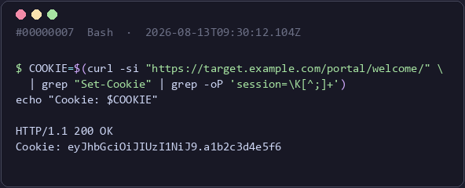

# claude-evidence

Auto-captures every `Bash` and MCP tool call in **Claude Code** as tamper-evident evidence for pentest / red-team reports — command + output, real screenshots, hash-chained, one command to a Markdown report.

**v0.4.4** — [CHANGELOG.md](CHANGELOG.md) for release notes, tags for versions.

- Arm with `/evidence-on`, everything after is captured automatically. No copy-paste.
- Captures Bash + the AI tools you've declared — Playwright, Windows-MCP, HexStrike AI. Other MCP servers aren't captured by default (configurable, see [Configuration](#configuration)).
- SHA-256 hash chain — any edit/delete/reorder of a step is detectable.
- Installed once globally; evidence stored per-project under `<project>/.evidence/` (auto-gitignored, raw/unredacted — redact before the report leaves your hands).

---

## Install

```bash
git clone https://github.com/dn9uy3n/claude-evidence
cd claude-evidence
python install.py
```

Copies the engine + 9 `/evidence-*` commands to `~/.claude/`, wires the capture hook into `settings.json`, installs Pillow + Pygments (for report rendering). **Restart Claude Code** after.

```bash
python install.py --dir /path/to/.claude   # different Claude dir
python install.py --no-deps                # skip Pillow/Pygments
python install.py --uninstall              # remove (keeps evidence)
```

## Update

Re-running the installer **is** the update — overwrites code/commands, re-merges the hook (no dupes), keeps your `evidence.config.json`.

```bash
python install.py --check    # compare installed vs. checkout version, changes nothing
python install.py --update   # git pull, then re-install
```

## Use

```
/evidence-on acme-corp-q1-2026        # arm capture for this project
   ... work — Bash + MCP calls captured automatically ...
/evidence-snap-web https://target/app --note "IDOR user 4412"
/evidence-note 7 "thick-client after exploit" --attack T1190
/evidence-status                      # armed? counts, chain OK?
/evidence-report                      # build the Markdown report
/evidence-off                         # verify chain, seal manifest, stop
```

| Command | Does |
|---|---|
| `/evidence-on [name]` | Arm capture for this project |
| `/evidence-off` | Verify chain, seal manifest, stop |
| `/evidence-resume [session-id] [--list]` | Re-arm a stopped session, same chain |
| `/evidence-status` | Armed? counts, chain integrity, version |
| `/evidence-note <seq> "<label>" [--attack Txxxx]` | Annotate a step |
| `/evidence-map` | Regenerate `map.md` index |
| `/evidence-report` | Build the Markdown report |
| `/evidence-snap-web <url>` | Playwright screenshot |
| `/evidence-snap-desktop` | Windows-MCP screenshot |

Each captured step gets rendered like this in the report — just the command and its real output, nothing else:



A step that already has a real screenshot (Playwright, Windows-MCP) embeds that image directly instead — no PNG-of-text gets generated for it.

## Works with your AI tooling

| Tool | Captured as |
|---|---|
| [Playwright MCP](https://github.com/microsoft/playwright-mcp) | real PNG screenshots; network/JS-eval steps flagged ⚠️ (may carry tokens) |
| [Windows-MCP](https://github.com/CursorTouch/Windows-MCP) | real PNG screenshots; `PowerShell`/`Registry`/`Clipboard` logged + flagged ⚠️ |
| [HexStrike AI](https://github.com/0x4m4/hexstrike-ai) | any list-shaped JSON response (scan results, findings) → real Markdown table |

These are the only MCP servers captured by default — everything else (RedTech, WireMCP, Jadx, ILSpy, Binary Ninja, SSH, ...) is out of scope unless you widen `allowed_mcp_servers`.

```bash
claude mcp add playwright -- npx @playwright/mcp@latest
claude mcp add --transport stdio windows-mcp -- uvx windows-mcp serve
claude mcp add --transport stdio hexstrike-ai -- python3 hexstrike_mcp.py --server http://localhost:8888
```

## What lands on disk

```
<project>/.evidence/<engagement>/<session_id>/
├── log.jsonl          # source of truth — append-only, hash-chained
├── map.md             # auto-regenerated index (screenshots + full timeline)
├── annotations.json   # your labels/ATT&CK tags (mutable, outside the chain)
├── steps/             # raw text per step
├── artifacts/         # real screenshots
└── report/            # report.md + rendered PNGs (on /evidence-report)
```

## Configuration

`~/.claude/evidence/evidence.config.json` (global default, survives re-installs) — override per-project with `<project>/.evidence/evidence.config.json`. Main keys: `capture` (bash/mcp/screenshots on-off), `allowed_mcp_servers` (which MCP servers are evidence sources at all — default `["playwright*", "windows-*", "hexstrike*"]`; empty/absent = every connected server), `image_producing_tools`, `sensitive_hint_tools`. Pattern keys match short tool names; prefix with `mcp__` to scope to one server.

## Notes

- Cross-platform (Windows/macOS/Linux). Optional hardening: `chattr +a log.jsonl` (Linux) or an `icacls` deny-write ACL (Windows).
- Not a replacement for git history — recover file contents from git, not this log.

## License

MIT — see [LICENSE](LICENSE).
